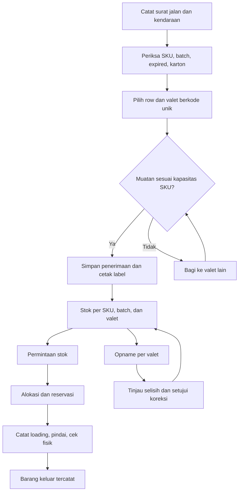
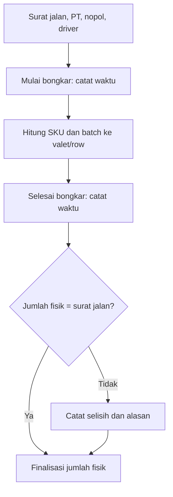
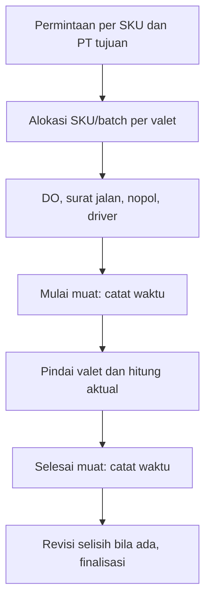
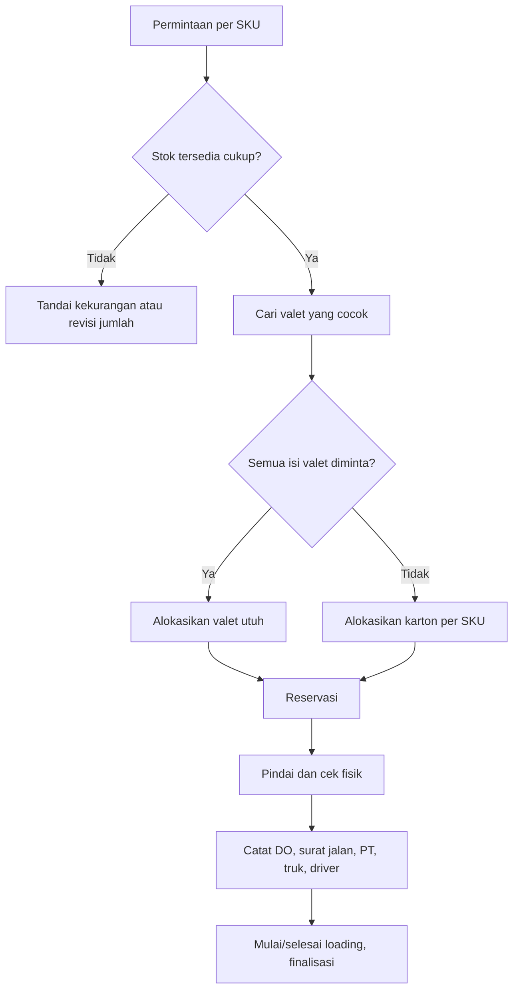
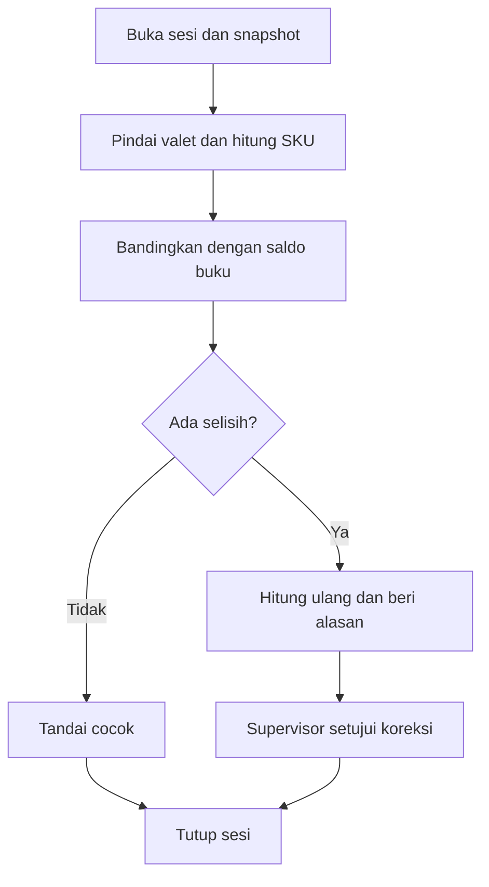
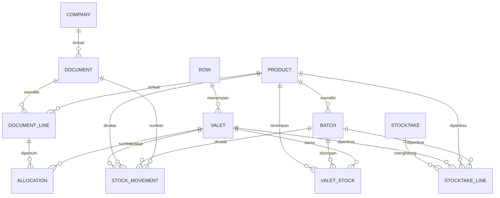
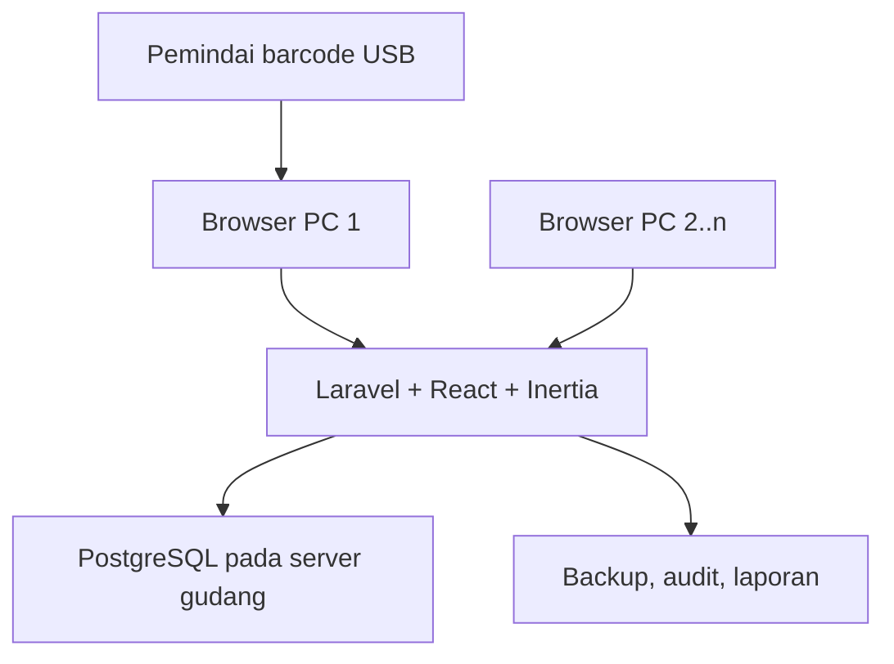

# PRD — Sistem Gudang Berbasis Valet

**Versi:** 1.8 (Laravel + React + Inertia + PostgreSQL)  
**Tanggal:** 26 September 2026  
**Platform:** aplikasi web intranet untuk browser pada beberapa PC; Laravel + React + Inertia dengan PostgreSQL.  
**Satuan stok utama:** karton

## 1. Ringkasan

Aplikasi mencatat barang masuk dan keluar beserta surat jalan, DO keluar, perusahaan asal/tujuan, nomor polisi kendaraan, driver, serta waktu mulai/selesai loading. Karton makanan ringan ditempatkan pada **valet** berkode unik yang masing-masing disimpan pada **row** berkode unik. Sistem memenuhi permintaan stok melalui valet utuh atau pengambilan sebagian karton, dan membandingkan stok fisik dengan catatan sistem saat opname. Satu valet dapat berisi beberapa SKU dan batch dengan tanggal kedaluwarsa. **Kapasitas karton ditetapkan per SKU di master barang**, sesuai ukuran kartonnya; 32 hanya contoh untuk produk tertentu, bukan batas semua valet. Beberapa PC mengakses satu stok gudang yang sama melalui layanan pusat.

> **Keputusan operasional:** semua valet berukuran fisik sama; valet selalu tinggal di gudang dan hanya kartonnya yang dikeluarkan. Row berkode unik menampung beberapa valet tanpa nomor slot atau batas posisi khusus. Tiap master SKU memiliki `maks_karton_per_valet`. Untuk valet campuran, pemakaian ruang dihitung sebagai `Σ(jumlah karton SKU / maks_karton_per_valet SKU)` dengan batas 1 valet penuh. Susunan fisik yang tetap tidak muat harus ditolak petugas. Surat jalan masuk/keluar dan DO keluar berasal dari pihak luar/aplikasi pihak ketiga; sistem ini merekam referensinya dan tidak menerbitkan nomor tersebut. Barcode warna pada sketsa adalah petunjuk visual tambahan; identitas resmi adalah kode unik yang dapat dipindai.

## 2. Tujuan dan batas

**Tujuan MVP**

- Mengetahui stok total per SKU, rincian stok per valet, serta row tempat valet tersimpan.
- Melihat susunan row dan valet sebagai peta gudang dengan jumlah karton yang terbaca langsung.
- Mencegah isi valet melampaui kapasitas menurut master barang serta mencegah stok negatif.
- Mengalokasikan permintaan berdasarkan isi valet yang benar, termasuk valet campuran.
- Menghasilkan bukti barang masuk, barang keluar, mutasi internal, dan penyesuaian opname.
- Menyediakan laporan jejak pergerakan yang bisa diaudit dan cadangan basis data pusat.

**Di luar MVP:** multi-gudang tersinkron otomatis, aplikasi mobile, integrasi otomatis ke aplikasi pihak ketiga, pembuatan nomor surat jalan/DO, dan operasi tulis tanpa koneksi ke layanan gudang pusat.

## 3. Istilah dan aturan dasar

| Istilah | Arti / aturan |
|---|---|
| SKU | Satu jenis/varian produk yang bisa diminta dan dihitung tersendiri. Kode SKU unik; `maks_karton_per_valet` wajib berupa bilangan bulat positif, misalnya 32 untuk karton besar dan 48 untuk karton kecil. |
| Karton | Satuan terkecil yang dicatat MVP; seluruh kuantitas bilangan bulat. |
| Valet | Wadah fisik berkode unik yang tetap di gudang, berisi satu atau lebih SKU/batch sesuai kapasitas dari master barang; kodenya tidak dipakai ulang untuk wadah berbeda. |
| Row | Baris penyimpanan berkode unik, misalnya `ROW-A01`; satu row dapat menampung banyak valet tanpa pencatatan slot. Setiap valet aktif berada pada tepat satu row. |
| Batch dan kedaluwarsa | Satu lot produksi untuk satu SKU dengan nomor batch dan tanggal kedaluwarsa; stok dan pergerakan dilacak hingga tingkat valet + SKU + batch. |
| Surat jalan dan DO | Nomor referensi eksternal; surat jalan dicatat untuk barang masuk dan keluar, DO pihak ketiga untuk barang keluar. Nomor transaksi internal aplikasi terpisah. |
| PT | Perusahaan asal barang untuk penerimaan, atau perusahaan tujuan untuk pengeluaran, dipilih dari master perusahaan. |
| Loading | Kegiatan bongkar saat barang masuk atau muat saat barang keluar; masing-masing punya waktu mulai dan selesai. |
| Stok tersedia | Karton fisik di gudang yang belum direservasi/ditahan dan belum kedaluwarsa, dihitung per valet, SKU, dan batch. |
| Reservasi | Jumlah dari valet tertentu yang dialokasikan untuk permintaan disetujui, tetapi belum keluar fisik. |
| Pengeluaran utuh | Semua karton di valet dikeluarkan; valet kosong tetap berada di row dalam gudang. |
| Pengeluaran parsial | Hanya SKU/jumlah tertentu dari valet dikeluarkan; sisanya tetap tercatat pada valet asal. |

Invarian: untuk tiap valet, `Σ(total karton SKU lintas batch / maks_karton_per_valet SKU) ≤ 1`; untuk satu SKU dalam valet, `total karton lintas batch ≤ maks_karton_per_valet`; `stok tersedia = stok fisik tercatat − reservasi aktif − stok ditahan`, dan bernilai 0 untuk batch kedaluwarsa; `0 ≤ reservasi + ditahan ≤ stok fisik valet/SKU/batch`. **Contoh:** A maksimum 32 dan B maksimum 48; isi 16 A + 24 B = `16/32 + 24/48 = 1`, penuh. Angka ini tidak boleh dibulatkan ke bawah saat validasi; gunakan perbandingan rasional/desimal presisi. Mengubah kapasitas master barang tidak boleh membuat valet yang sudah berisi menjadi melebihi kapasitas: validasi seluruh valet terdampak atau blokir perubahan sampai stok dipindahkan. Setiap operasi final memperbarui ledger, saldo, dan status dokumen **dalam satu transaksi basis data pusat**. Draft dan pembatalan draft tidak mengubah stok. Dokumen final tidak diedit/dihapus; koreksi menggunakan dokumen pembalik atau penyesuaian dengan alasan.

## 4. Pengguna dan hak akses

| Peran | Kebutuhan | Kewenangan MVP |
|---|---|---|
| Petugas gudang | Terima, susun, pindah, pindai, picking, hitung fisik | Buat draft; konfirmasi penerimaan/picking sesuai penugasan; isi hasil hitung |
| Supervisor | Kendali stok dan selisih | Setujui pengeluaran, penyesuaian opname, dan pembalikan dokumen |
| Admin | Konfigurasi dan pemulihan | Kelola SKU beserta kapasitasnya, master perusahaan, row, akun pengguna, cadangan/pemulihan |

Setiap operator login melalui browser dengan akun sendiri; hak akses dan audit dipusatkan pada aplikasi Laravel. Beberapa PC dapat membuka URL intranet yang sama dan bekerja bersamaan. Browser hanya berkomunikasi dengan aplikasi Laravel; kredensial database tidak pernah dikirim ke PC operator. Bila server atau LAN tidak tersedia, browser menampilkan status koneksi dan tidak menerima perubahan stok hingga tersambung kembali.

## 5. Alur utama

### 5.1 Barang masuk

1. Petugas membuat dokumen penerimaan dengan nomor internal, tanggal, **nomor surat jalan eksternal, PT asal dari master perusahaan, nomor polisi kendaraan, nama driver**, serta baris **nama barang/SKU, jumlah karton menurut surat jalan, nomor batch, dan tanggal kedaluwarsa**. Nomor surat jalan yang pernah dipakai untuk PT dan arah transaksi sama diberi peringatan duplikasi untuk diperiksa. Nomor ini dicatat persis dari dokumen luar.
2. Saat truk mulai dibongkar, petugas menekan **Mulai bongkar/loading** dan sistem mencatat waktu aktual. Petugas menghitung jumlah karton diterima per **SKU dan batch**, memverifikasi tanggal kedaluwarsa pada karton, serta memisahkan jumlah surat jalan dari jumlah fisik agar selisih terlihat. Batch atau tanggal kedaluwarsa yang tidak tersedia harus dilengkapi/diverifikasi sebelum penerimaan final, bukan diisi dengan nilai rekaan.
3. Petugas memilih valet yang masih aktif atau membuat valet baru dengan kode unik, **row berkode unik**, label barcode/QR, dan atribut warna opsional. Campuran SKU dan batch diperbolehkan; sistem memperlihatkan jumlah tiap SKU/batch serta persentase ruang terpakai dan sisa menurut kapasitas master barang. Setiap karton diterima dialokasikan ke valet sehingga jumlah per SKU/batch di valet sama dengan jumlah fisik diterima.
4. Penerimaan dapat dibagi ke beberapa valet. Sistem menolak SKU nonaktif, jumlah ≤ 0, kode valet/row ganda, atau isi akhir yang melampaui kapasitas menurut master barang. Jika ada beberapa ukuran fisik valet, ukuran valet harus dimodelkan terpisah dan aturan kapasitas disesuaikan.
5. Setelah pemeriksaan, petugas menekan **Selesai bongkar/loading**. Sistem mencatat waktu selesai (harus ≥ mulai), menampilkan selisih surat jalan vs fisik untuk diakui petugas dengan alasan, lalu finalisasi menambah stok **sebanyak karton fisik yang diterima** per SKU/batch/valet dan membuat ledger secara atomik. Produk yang kedaluwarsa atau tanggalnya meragukan ditahan untuk keputusan supervisor dan tidak menjadi stok tersedia. Cetak/ulang cetak label tidak menambah stok.

### 5.2 Permintaan dan barang keluar

1. Pemohon/petugas memilih **PT tujuan dari master perusahaan**, memasukkan SKU, jumlah karton yang diminta, tanggal perlu, dan catatan. Nomor DO dari aplikasi pihak ketiga dicatat pada permintaan/pengeluaran dan divalidasi sebelum pengeluaran final. Status: `draft → diajukan → disetujui → dialokasikan → dipicking → selesai`; dapat `ditolak` atau `dibatalkan` sebelum selesai.
2. Sistem menampilkan stok fisik, stok terreservasi, stok tersedia, dan kekurangan **per SKU**. Persetujuan tidak boleh melebihi ketersediaan kecuali supervisor mengizinkan pemenuhan parsial yang dicatat eksplisit.
3. Sistem menyarankan sumber berdasarkan **FEFO**: batch dengan tanggal kedaluwarsa paling dekat yang belum kedaluwarsa dipilih dahulu; jika tanggal sama, gunakan urutan penerimaan/valet. Usulan valet utuh boleh muncul jika seluruh isinya sesuai dengan permintaan dan aturan FEFO. Petugas dapat mengganti sumber dengan alasan dan persetujuan supervisor. Batch kedaluwarsa tidak boleh dialokasikan untuk pengeluaran normal.
4. Alokasi menyimpan pasangan `kode valet + SKU + batch + jumlah` dan membuat reservasi. Valet boleh dikosongkan seluruhnya bila **setiap SKU/batch di valet** dialokasikan dalam dokumen yang sama; jika tidak, lakukan picking parsial atau pindahkan isi secara tercatat.
5. Sebelum muat, petugas mengisi **nomor DO dan surat jalan eksternal, PT tujuan dari master, nomor polisi, dan driver**, lalu menekan **Mulai muat/loading** untuk merekam waktu aktual. Saat muat, petugas memindai kode valet, memeriksa batch dan tanggal kedaluwarsa, lalu mencatat jumlah karton aktual per SKU/batch/valet.
6. Setelah selesai, petugas menekan **Selesai muat/loading**; sistem mencatat waktu selesai (harus ≥ mulai). Sistem menampilkan perbandingan jumlah diminta/disetujui dengan jumlah aktual. Kekurangan atau kelebihan memicu revisi alokasi/persetujuan dan pencatatan alasan; jumlah aktual tidak boleh diam-diam mengganti jumlah permintaan.
7. Finalisasi mengurangi stok **sebanyak karton aktual yang keluar** per SKU/batch/valet, melepaskan reservasi terkait, dan membuat bukti keluar yang memuat referensi DO/surat jalan, batch, identitas angkutan, serta waktu mulai/selesai. Nomor eksternal tidak dibuat oleh aplikasi dan tidak disamakan otomatis dengan nomor transaksi internal.
8. **Valet fisik tetap di gudang** pada row semula, menjadi kosong atau berisi sisa karton. Retur barang yang sudah keluar diproses sebagai dokumen masuk baru dengan referensi dokumen keluar asal dan pemeriksaan ulang batch/kedaluwarsa.

**Contoh sketsa:** Bila master Ciki A menetapkan maksimum 32 karton per valet dan permintaan 100 karton Ciki A, alokasi `32 + 32 + 32 + 4` dari valet 001–004 sah **hanya jika** ketiga valet pertama benar-benar memuat masing-masing 32 Ciki A, dan valet 004 memuat minimal 4 Ciki A. Jika Ciki A lebih kecil dan maksimumnya 50, sistem menghitung ulang sumber berdasarkan isi aktual, bukan memaksa pembagian 32. Bila valet 001 di row A berisi `2 Ciki A + 1 Ciki B`, sistem hanya menghitung **2 Ciki A** dari valet 001; Ciki B tetap ada kecuali juga tercantum dalam permintaan. Setelah 2 Ciki A keluar, stok Ciki A berkurang dari 100 menjadi 98, dan isi valet 001 berkurang 2; saldo Ciki B tetap 1.

### 5.3 Pindah dan konsolidasi valet

Petugas dapat memindahkan **valet utuh** ke row lain tanpa mengubah total stok SKU/batch, atau memindahkan **sebagian karton** dari valet A ke valet B, termasuk antar-row. Konsolidasi divalidasi terhadap kapasitas valet tujuan dan reservasi sumber per SKU/batch. Perpindahan row menyimpan row asal dan tujuan pada riwayat valet; pindah isi mencatat kedua sisi mutasi dalam satu transaksi, beserta alasan dan operator. Valet kosong tetap terlihat di row dan dapat diisi kembali dengan kode yang sama; riwayatnya tetap ada.

Jika valet pindah row, petugas memilih row tujuan dan mengonfirmasi perpindahan fisik; peta segera menampilkan valet di kelompok row baru. Tidak ada pemilihan nomor slot/posisi; kode valet tidak berubah saat pindah.

### 5.4 Stok opname

1. Supervisor membuka sesi opname dengan cakupan row/valet atau semua gudang dan waktu snapshot. Sistem menyimpan saldo buku per SKU/batch dan row tiap valet pada pembukaan sesi.
2. Petugas memindai row, lalu tiap valet dalam row tersebut dan menghitung setiap **SKU dan batch**, memverifikasi tanggal kedaluwarsa, termasuk batch tak terduga. Isi fisik yang melampaui kapasitas menurut master barang diberi peringatan dan harus dipindah/dipecah secara tercatat sebelum koreksi final; tidak otomatis mengganti saldo. Valet yang ditemukan pada row lain dicatat sebagai selisih row untuk dikoreksi.
3. Sistem menampilkan `saldo buku saat penghitungan`, `jumlah fisik`, dan `selisih` per valet/SKU/batch. Valet yang tak ditemukan dan valet fisik tanpa kode tercatat sebagai pengecualian terpisah.
4. Setelah review/recount, supervisor menyetujui penyesuaian dengan alasan; sistem membuat ledger penyesuaian per valet/SKU/batch. Pindah stok selama opname harus dibekukan untuk cakupan yang dihitung atau direkonsiliasi ulang sebelum persetujuan agar snapshot tidak basi.
5. Sesi ditutup dengan rekap selisih, operator, tanggal, dan nomor dokumen koreksi. Hasil hitung tidak mengubah stok sebelum disetujui.

### 5.5 Peta visual row dan valet

**Tujuan layar:** petugas dapat melihat valet per row dan jumlah karton tanpa membuka dokumen transaksi satu per satu. Tampilan web utama menampilkan daftar row sebagai kelompok yang dapat dibuka/tutup. Dalam tiap row, kartu valet ditata dalam grid dan **diurutkan berdasarkan kode valet**. Urutan grid membantu pencarian; bukan klaim posisi fisik/nomor slot tertentu di sepanjang row.

| ROW-A01 · 5 valet · 69 karton fisik | Kartu valet 001 | Kartu valet 002 | Kartu valet 003 | Kartu valet 004 | Kartu valet 005 |
|---|---|---|---|---|---|
| **Isi** | A: 2, B: 1 | A: 32 | A: 32 | Kosong | B: 2 |
| **Total karton** | **3** | **32** | **32** | **0** | **2** |
| **Terreservasi** | A: 2 | A: 32 | 0 | 0 | 0 |
| **Muatan** | Sesuai SKU | 100%* | 100%* | 0% | Sesuai SKU |

\* Contoh 100% hanya bila master A menetapkan maksimum 32 karton per valet. Angka 69 adalah jumlah karton fisik seluruh valet dalam row pada contoh; reservasi tidak dikurangkan dari angka fisik. Produk B mempunyai batas per valet sendiri. Contoh ini adalah representasi layout, bukan ketentuan bahwa tiap row hanya berisi lima valet.

Setiap **kartu valet** wajib menampilkan kode valet, total karton fisik, maksimal tiga SKU beserta jumlahnya dan indikator `+n SKU lain` bila perlu, jumlah terreservasi, serta persentase muatan berdasarkan master SKU. Valet kosong tetap terlihat sebagai `0 karton`. Batch yang segera kedaluwarsa atau sudah kedaluwarsa diberi penanda teks; detail kartu memuat nomor batch, tanggal kedaluwarsa, fisik, reservasi, dan tersedia. Angka karton dan persentase muatan ditampilkan terpisah karena karton kecil dan besar tidak setara ukurannya.

Header **row** menampilkan kode, jumlah valet aktif, jumlah karton fisik, dan jumlah karton terreservasi. Filter SKU atau batch mengubah jumlah pada header dan kartu menjadi **jumlah yang terpilih**, dengan label eksplisit `Ciki A / batch X: n karton`; jangan menampilkan total semua SKU seolah-olah stok yang difilter. Pencarian menerima kode row, kode valet, SKU, nama barang, dan nomor batch; hasil menyorot valet yang cocok. Warna membantu menandai kosong, penuh, dan ada reservasi, tetapi teks dan angka tetap wajib terbaca.

Klik/pindai valet membuka panel detail: row, seluruh SKU dan batch (`fisik`, `reservasi`, `tersedia`, kedaluwarsa), total karton, persentase muatan, riwayat masuk/keluar/pindah/opname, serta tindakan yang sesuai hak akses. Semua browser membaca data dari aplikasi/server yang sama; halaman dimuat ulang atau diperbarui berkala setelah transaksi final atau pindah row dari operator lain. Selama dokumen masih draft, saldo fisik tetap seperti semula, sedangkan reservasi yang sudah dibuat langsung mengubah angka tersedia.

### 5.6 Pengendalian batch dan kedaluwarsa

- Setiap karton yang diterima memiliki SKU, nomor batch, dan tanggal kedaluwarsa. Batch yang sudah terdaftar untuk SKU yang sama harus memakai tanggal kedaluwarsa yang konsisten; konflik diblokir untuk pemeriksaan supervisor.
- Stok fisik batch kedaluwarsa tetap tercatat di valet dan masuk total karton fisik, tetapi **tidak tersedia** untuk permintaan/pengeluaran normal. Stok yang ditahan karena label meragukan juga tidak tersedia. Operator melihat kedua jumlah ini terpisah.
- Tanggal kedaluwarsa dibaca sebagai tanggal gudang setempat: karton berlaku sampai akhir tanggal tercetak, lalu tidak tersedia mulai hari berikutnya. Waktu layanan pusat menjadi acuan agar seluruh PC memberi hasil yang sama.
- Urutan usulan picking mengikuti FEFO di antara batch yang masih layak; tanggal kedaluwarsa dibandingkan dengan **tanggal muat/pengeluaran**, bukan hanya tanggal pembuatan permintaan. Jika batch menjadi kedaluwarsa setelah direservasi, alokasi dibatalkan/dialihkan sebelum finalisasi.
- Laporan per SKU/batch menampilkan valet dan row, karton fisik/tersedia/ditahan, tanggal kedaluwarsa, dan kelompok `kedaluwarsa`, `≤ 30 hari`, serta `> 30 hari`. Batas peringatan 30 hari bisa diubah admin. Penyesuaian/pemusnahan stok kedaluwarsa memerlukan dokumen dan persetujuan supervisor.

## 6. Persyaratan fungsional

| ID | Prioritas | Kebutuhan dan hasil yang dapat diuji |
|---|---|---|
| F-01 | P0 | CRUD SKU dengan maksimum karton per valet, row berkode unik, dan master perusahaan asal/tujuan; nonaktifkan tanpa menghapus riwayat. Perubahan kapasitas memvalidasi stok yang sudah ada. |
| F-02 | P0 | Buat valet berkode unik, tempatkan di row, dan cetak label yang dapat dipindai; lihat isi, row, kapasitas terpakai, status, dan histori. |
| F-03 | P0 | Masuk campuran SKU/batch ke banyak valet; batch dan kedaluwarsa wajib, finalisasi menolak pemakaian ruang > 100% menurut master barang. |
| F-03a | P0 | Barang masuk/keluar mencatat nomor surat jalan eksternal, DO eksternal untuk keluar, PT asal/tujuan dari master, nomor polisi, driver, waktu mulai dan selesai loading; jumlah surat jalan, fisik, dan selisih per SKU/batch dapat ditinjau. |
| F-04 | P0 | Dashboard dan pencarian stok per SKU, valet, dan row; saldo tersedia memperhitungkan reservasi. |
| F-04a | P0 | Peta gudang mengelompokkan valet berdasarkan row dan mengurutkan kode valet tanpa slot; setiap kartu menampilkan total karton, rincian SKU, reservasi, muatan, dan status kosong/penuh; detail menampilkan batch/kedaluwarsa. |
| F-05 | P0 | Permintaan per SKU, persetujuan, alokasi per SKU/batch/valet dengan usulan FEFO, pemenuhan parsial, dan pembatalan yang melepas reservasi. |
| F-06 | P0 | Pengeluaran hasil pindai valet; valet selalu di gudang; bukti keluar menunjukkan DO, surat jalan, SKU/batch, jumlah diminta/aktual, identitas truk/driver, serta waktu loading. |
| F-07 | P0 | Mutasi valet antar-row dan pindah isi antarvalet per SKU/batch tanpa mengubah total stok gudang; riwayat row asal/tujuan terlacak. |
| F-08 | P0 | Opname per valet/SKU/batch, verifikasi kedaluwarsa, recount, persetujuan penyesuaian, dan laporan selisih. |
| F-09 | P0 | Ledger permanen berisi jenis mutasi, kuantitas bertanda, referensi dokumen, pengguna, timestamp, alasan. |
| F-10 | P0 | Ekspor CSV laporan dan backup/restore terverifikasi pada host pusat dengan konfirmasi sebelum mengganti basis data pusat. |
| F-10a | P0 | Beberapa PC memakai akun masing-masing melalui layanan pusat; perubahan stok atomik dan konsisten; klien memuat ulang bila data berubah di PC lain dan tidak mengirim ulang finalisasi yang sama dua kali. |
| F-10b | P0 | Laporan batch yang mendekati kedaluwarsa/kedaluwarsa; batch kedaluwarsa tidak dapat dialokasikan untuk pengeluaran normal. |
| F-11 | P1 | Cetak label valet dan dokumen penerimaan/pengeluaran pada printer biasa atau barcode. |
| F-12 | P1 | Filter riwayat transaksi, SKU lambat bergerak, kapasitas valet, dan pengecualian opname. |

**Layar MVP:** Ringkasan Gudang; SKU; Peta Gudang (Row & Valet); Barang Masuk; Permintaan Stok; Picking/Barang Keluar; Mutasi Valet; Stok Opname; Riwayat & Laporan; Pengaturan/Backup.

## 7. Model data konseptual

| Tabel | Kolom penting / aturan |
|---|---|
| `products` | `id`, `sku UNIQUE`, `name`, `max_cartons_per_valet INTEGER > 0`, `active`; ukuran karton dapat disimpan sebagai informasi tambahan. |
| `rows` | `id`, `code UNIQUE`, `name`, `active`; boleh berisi banyak valet tanpa slot/posisi numerik. |
| `valets` | `id`, `code UNIQUE`, `row_id NOT NULL`, `status`, `label_color`, `created_at`; kode tetap permanen. |
| `valet_row_movements` | `valet_id`, `from_row_id`, `to_row_id`, `document_id`, `moved_by`, `moved_at`; jejak pindah row. |
| `companies` | `id`, `code UNIQUE`, `name`, `active`; referensi asal/tujuan pada dokumen. |
| `batches` | `id`, `product_id`, `batch_no`, `expires_on DATE NOT NULL`, `status`; pasangan `(product_id, batch_no)` unik. Nomor batch yang sama untuk SKU sama tetapi tanggal expired berbeda memicu pemeriksaan, bukan entri lot kedua diam-diam. |
| `valet_stock` | `valet_id`, `product_id`, `batch_id`, `qty_on_hand >= 0`, `qty_reserved >= 0`, `qty_held >= 0`; kombinasi valet+SKU+batch unik, `qty_reserved + qty_held ≤ qty_on_hand`. |
| `documents` | `id`, `number UNIQUE` (nomor internal), `type` (receipt/request/issue/transfer/adjustment/reversal), `status`, `delivery_note_no`, `delivery_order_no`, `company_id`, `vehicle_plate`, `driver_name`, `loading_started_at`, `loading_finished_at`, `created_by`, `approved_by`, waktu. Nomor eksternal disimpan sebagai referensi; DO wajib pada keluar. |
| `document_lines` | `document_id`, `product_id`, `batch_id` untuk penerimaan/aktual picking, `qty_delivery_note`, `qty_requested`, `qty_approved`, `qty_actual`, `discrepancy_reason`. Permintaan dapat per SKU tanpa batch, alokasi aktual harus per batch. |
| `allocations` | `document_line_id`, `valet_id`, `batch_id`, `qty_reserved`, `qty_picked`, `status`; jumlah alokasi batch tidak melebihi saldo tersedia pada valet. |
| `stock_movements` | `document_id`, `valet_id`, `product_id`, `batch_id`, `qty_delta` (+/−), `movement_type`, `created_by`, `created_at`, `reversal_of_id`; append only. |
| `stocktakes` / `stocktake_lines` | cakupan, snapshot waktu, status, valet, SKU, batch, kedaluwarsa, buku, fisik, selisih, recount, alasan, persetujuan. |
| `users` / `audit_events` | pengguna dan peran terpusat, aksi, identitas dokumen, waktu. Simpan hash password yang layak, bukan teks biasa. |

**Sumber kebenaran:** `stock_movements` menyimpan sejarah; `valet_stock` adalah saldo materialisasi per valet/SKU/batch untuk baca cepat yang harus diperbarui atomik dari transaksi yang sama. Rekonsiliasi berkala memeriksa `SUM(qty_delta)` terhadap saldo dan agregasi batch/SKU/valet. Muatan dihitung dari total saldo setiap SKU lintas batch dibagi `max_cartons_per_valet` pada master barang. Mutasi antarvalet mencatat baris negatif pada sumber dan positif pada tujuan; mutasi valet utuh antar-row dicatat pada `valet_row_movements` tanpa perubahan stok. Dokumen permintaan/reservasi sendiri belum menghasilkan pergerakan stok fisik.

## 8. Rancangan teknis

- **Laravel React Starter Kit:** gunakan starter kit resmi Laravel yang mencakup React, TypeScript, Inertia, autentikasi dasar, dan komponen UI. Nama stack aplikasi adalah **Laravel + React + Inertia**. Laravel menangani route, controller, validasi, autentikasi, otorisasi, transaksi stok, laporan, dan akses database. React membangun layar gudang dan peta row/valet melalui Inertia; browser tidak mengakses database langsung. Satu repositori menjaga aturan bisnis dan UI tetap dalam satu aplikasi.
- **Menjalankan lokal saat pengembangan:** jalankan `composer run dev`, lalu buka alamat lokal yang ditampilkan. Untuk mencoba akses dari PC lain, jalankan aplikasi pada host yang dapat dijangkau melalui LAN, atur binding web server ke alamat jaringan host, lalu buka `http://alamat-host:port` dari browser klien.
- **Server pusat intranet:** jalankan aplikasi Laravel dan PostgreSQL pada server gudang yang memakai alamat LAN tetap. Untuk tahap awal keduanya boleh berada pada satu host; batasi port PostgreSQL ke aplikasi/server yang berwenang dan jangan buka ke internet publik. PC operator hanya membutuhkan browser dan akses LAN. Siapkan startup otomatis, pemantauan layanan, backup, dan cadangan daya sesuai kebutuhan.
- **PostgreSQL:** gunakan migrasi Laravel, foreign keys, unique/check constraints untuk aturan yang dapat ditegakkan di database, serta indeks pada kode SKU, batch, valet, row, status, dan timestamp laporan. Simpan koneksi PostgreSQL pada konfigurasi server (`DB_CONNECTION=pgsql` dan variabel `DB_HOST`, `DB_PORT`, `DB_DATABASE`, `DB_USERNAME`, `DB_PASSWORD`); rahasia tidak berada dalam frontend. PostgreSQL mendukung transaksi dan kontrol konkurensi untuk beberapa pengguna sekaligus.
- **Konsistensi dan akses:** Laravel memvalidasi peran dan seluruh invarian dalam transaksi database. Reservasi dan pengeluaran mengunci baris saldo valet/SKU/batch terkait saat memeriksa lalu mengubah stok (`lockForUpdate`), agar dua operator tidak mengalokasikan stok yang sama. Finalisasi memakai kunci idempoten agar klik ulang atau koneksi putus tidak menggandakan mutasi. Bila stok berubah saat operator bekerja, server menolak konflik dan halaman memuat saldo terbaru. Pembaruan tampilan dapat memakai polling ringan saat halaman aktif.
- **Barcode:** awali dengan pemindai USB mode keyboard dan cetak kode valet (misalnya Code 128 atau QR). Validasi kode pada layar; tidak perlu integrasi perangkat khusus pada MVP.
- **Backup:** jadwalkan dump PostgreSQL (`pg_dump`) harian ke media terpisah dan retensi beberapa versi; pantau keberhasilan backup. Uji pemulihan berkala ke database terpisah dengan `pg_restore` dan validasi jumlah saldo/ledger sebelum dipakai kembali. Simpan backup di luar host aplikasi agar kegagalan satu perangkat tidak menghilangkan data dan cadangan sekaligus.

## 9. Persyaratan nonfungsional dan penerimaan

| Area | Target MVP |
|---|---|
| Jaringan | Internet tidak diperlukan; semua PC membuka aplikasi web melalui LAN. Bila LAN/server putus, halaman menampilkan status data tidak mutakhir dan menolak perubahan stok sampai tersambung. |
| Integritas | Tidak ada transaksi final yang menghasilkan saldo negatif atau muatan valet > 100% menurut kapasitas SKU di master; kegagalan di tengah operasi melakukan rollback seluruh perubahan. |
| Kecepatan | Pencarian kode valet/SKU dan pembukaan detail umumnya < 2 detik pada data uji 10.000 valet / 100.000 mutasi dari browser klien melalui LAN pada perangkat target. |
| Audit | Setiap finalisasi, persetujuan, pembalikan, dan pemulihan memiliki operator, waktu, alasan/referensi. |
| Ketahanan | Backup otomatis harian dan manual pada host pusat; lakukan simulasi restore dari berkas hasil aplikasi sebelum rilis. |
| Akses | Navigasi keyboard, fokus jelas, tabel mudah dibaca, hasil scan dan kesalahan terlihat. |

### Skenario uji penerimaan prioritas

1. Master A maksimum 32, B maksimum 48; masukkan 16 A + 24 B ke valet 001 → muatan 100% diterima, tambahan 1 karton ditolak.
2. Permintaan 100 A dengan stok A total 98 dan B 10 → tampil kekurangan 2 A; B tidak digunakan mengganti A.
3. Valet 001 berisi 2 A + 1 B; keluarkan 2 A → valet 001 tersisa 1 B, stok total A turun 2, stok B tetap.
4. Reservasi 4 A dari valet 004, kemudian permintaan lain mencoba mengambil semua stok A yang sama → sistem hanya menawarkan saldo yang belum direservasi.
5. Batalkan permintaan sebelum serah → seluruh reservasi dilepas, stok fisik tidak berubah.
6. Master A maksimum 32, B maksimum 48; valet 002 berisi 16 A + 24 B. Pindahkan 1 karton A dari valet 001 → ditolak karena muatan tujuan sudah 100%; kedua valet tetap seperti semula.
7. Opname menemukan sistem 28, fisik 27 → sebelum persetujuan saldo tetap 28; setelah persetujuan saldo 27 dan ledger mencatat −1 dengan alasan.
8. Coba mengosongkan valet berisi A dan B ketika dokumen hanya meminta A → ditolak sebagai pengeluaran seluruh isi; opsi parsial hanya mengurangi A dan valet tetap di gudang.
9. Aplikasi ditutup saat finalisasi yang gagal → saat dibuka lagi dokumen/saldo/ledger konsisten, tanpa pengeluaran setengah jalan.
10. Valet 001 dipindah dari `ROW-A01` ke `ROW-B02` → kode valet dan total stok tetap, row sekarang berubah, row asal/tujuan muncul dalam riwayat.
11. Master A yang maksimum 32 akan diubah menjadi 16 saat ada valet berisi 20 A → perubahan ditolak dan kapasitas lama tetap aktif sampai isi valet dikurangi.
12. Surat jalan masuk mencantumkan 50 A, hasil bongkar 48 A → tampil selisih −2; setelah alasan dicatat dan selesai loading, saldo hanya bertambah 48 A yang dialokasikan ke valet.
13. Surat jalan keluar untuk 20 A, tetapi hasil muat 18 A → revisi/alasan wajib; setelah disetujui, saldo turun 18 A dan bukti menunjukkan permintaan 20 serta aktual 18.
14. Finalisasi masuk atau keluar tanpa perusahaan dari master, nomor polisi, driver, surat jalan, atau waktu selesai loading → ditolak; keluar tanpa nomor DO → ditolak; waktu selesai lebih awal dari waktu mulai → ditolak.
15. Buka `ROW-A01` pada peta → valet terurut berdasarkan kode tanpa nomor slot; kartu 001 memperlihatkan A: 2, B: 1, total fisik 3 dan reservasi A: 2; kartu valet 004 kosong tetap menunjukkan 0 karton.
16. Filter peta ke Ciki A → header menunjukkan jumlah Ciki A saja dan kartu 001 menunjukkan 2 A; total semua SKU tetap dapat dilihat pada detail tanpa dicampur dengan hasil filter.
17. Pindah valet 001 dari `ROW-A01` ke `ROW-B02` → peta kedua row berubah, stok SKU/batch tetap, dan riwayat menyimpan row asal/tujuan tanpa nomor slot.
18. Masuk 10 karton A batch `LOT-01` expired 2026-12-31 ke valet 001 → master batch tersimpan dan peta menampilkan jumlah; coba masuk batch sama dengan expired berbeda → ditolak untuk pemeriksaan.
19. Dua batch A tersedia, `LOT-01` kedaluwarsa 2026-10-15 dan `LOT-02` kedaluwarsa 2027-03-01 → saran picking mengambil `LOT-01` dahulu; setelah tanggal pengeluaran melampaui 2026-10-15, `LOT-01` tetap dihitung fisik tetapi tidak tersedia.
20. PC 1 dan PC 2 mengalokasikan karton sama hampir bersamaan → tepat satu alokasi berhasil sesuai saldo tersisa; klien lain menampilkan konflik dan angka terbaru. Mengulang permintaan finalisasi dengan kunci idempoten sama tidak membuat mutasi kedua.
21. Browser klien terputus dari server setelah mengirim finalisasi → saat kembali terhubung, halaman mengecek status kunci idempoten dan menampilkan hasil transaksi yang sudah terjadi tanpa mengulangi pengurangan stok.
22. Barang keluar mencatat nomor DO dan surat jalan dari pihak ketiga serta perusahaan tujuan dari master; nomor internal transaksi berbeda dan tidak mengganti nomor dokumen luar.
23. Penerimaan 10 karton A tanpa nomor batch atau tanggal kedaluwarsa → tidak dapat difinalisasi sampai informasi kemasan/dokumen diverifikasi dan diisi.
24. Setelah seluruh isi valet 001 keluar, valet 001 tetap terlihat di row asal dengan 0 karton dan dapat dipakai lagi tanpa membuat kode baru.

## 10. Tahapan dan keputusan yang perlu dikonfirmasi

**Tahap 1:** aplikasi Laravel + React + Inertia pada server intranet, login dan hak akses browser, master SKU/kapasitas, perusahaan, batch/kedaluwarsa, row/valet, penerimaan, stok per valet, label.  
**Tahap 2:** permintaan, reservasi per batch, FEFO, picking, DO/surat jalan eksternal, pengeluaran, mutasi internal, kontrol konflik antarklien.  
**Tahap 3:** opname per batch, laporan kedaluwarsa, audit, backup/restore dan uji skenario lapangan.

**Keputusan terkonfirmasi:** (1) semua valet berukuran sama; kapasitas karton berasal dari master barang; (2) row tidak memerlukan slot/posisi atau batas jumlah valet; (3) valet tidak pernah keluar dari gudang; (4) batch dan kedaluwarsa wajib; (5) beberapa PC menggunakan satu data yang sama; (6) perusahaan adalah data master; (7) surat jalan dan DO berasal dari pihak luar/aplikasi pihak ketiga. Pada MVP, nomor eksternal diketik/dipindai dan dicocokkan oleh petugas; integrasi otomatis pihak ketiga belum termasuk.

**Keputusan implementasi yang tersisa:** perangkat/OS host aplikasi di gudang dan alamat LAN; apakah semua barang memiliki nomor batch dan tanggal kedaluwarsa yang bisa dibaca pada kemasan/dokumen saat penerimaan; aturan penanganan fisik/dokumen untuk batch kedaluwarsa. Nilai awal aplikasi: batch dan tanggal wajib, batch kedaluwarsa ditahan dan dilarang keluar sebagai stok normal.

## Referensi teknis

- [Laravel — starter kit React](https://laravel.com/starter-kits) dan [dukungan database PostgreSQL](https://laravel.com/docs/database).
- [PostgreSQL — concurrency control](https://www.postgresql.org/docs/current/mvcc.html) dan [pg_dump](https://www.postgresql.org/docs/current/app-pgdump.html).
